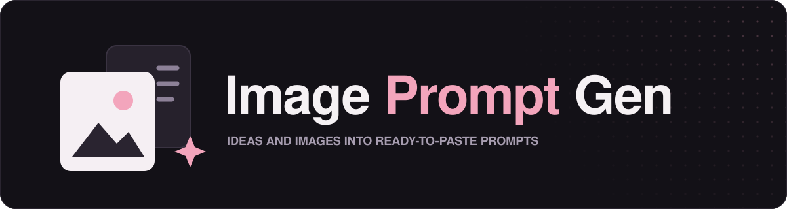
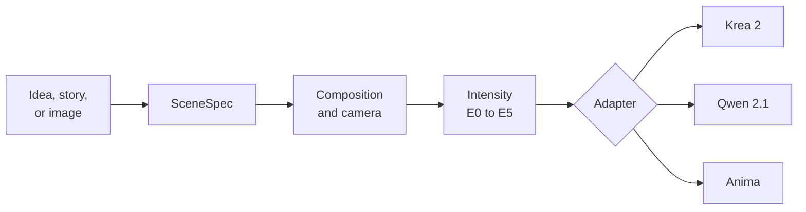

<p align="center">
  
</p>

<p align="center">
  <b>English</b> | <a href="docs/README.zh-TW.md">繁體中文</a>
</p>

<p align="center">
  <a href="LICENSE"></a>
  <a href="https://skills.sh/Zhen-Bo/image-prompt-gen"></a>
</p>

An agent skill that turns a scene idea, a story, or a reference image into an English prompt you can paste straight into a local **Krea 2**, **Qwen Image 2.1**, or **Anima** workflow.

## Why this skill

This skill works like a compiler. It first decides **what the image is**: the event, the composition, the camera, and the light. Only then does it decide **how to say it** for the model you use.

So when you switch models, change the intensity level, or ask for "the same scene, but at night", the scene stays the same. Only the wording changes.



Every request becomes one internal scene description (the SceneSpec). Each model adapter then writes that same scene in the form its model reads best.

## Highlights

- **Scenes as events.** Prompts describe what is happening and who reacts, instead of listing objects.
- **Composition first.** Every prompt states its camera in visible terms, like `framed from mid-thigh up`. Real-camera terms like focal length are left out.
- **Consistent edits.** `same scene, Qwen` or `same scene, E2` keeps everything else fixed.
- **Reverse prompting.** Give it an image and a format. It rebuilds the framing and pose so a different LoRA still lands the same composition.
- **Designed characters.** When you skip the look or give only part of it, it designs the rest from anime archetypes, with materials and accessories placed where they belong.
- **Varied takes, minimal edits.** Ask for several versions of a theme and each one explores it with a different camera, composition, moment, or light. Edit an existing prompt and only the affected words change.
- **LoRA controls style.** Rendering style is left to your LoRA, so prompts never add words like `masterpiece` unless you ask.

## Installation

```bash
npx skills add Zhen-Bo/image-prompt-gen
```

Start a new agent session. In Claude Code you can check that it loaded by typing `/image-prompt-gen`.

## Quick start

Describe the scene. You don't need to say "prompt". If you haven't picked a model yet, the skill asks once and remembers your answer.

```text
A girl sits by the window watching the rain, like she's waiting for someone. Krea 2.
```

Expected output, one paragraph ready to paste:

```text
A girl with a short platinum-blonde bob sits sideways on a wide wooden windowsill,
one knee drawn up and her chin resting on it, the hem of her oversized gray fleece
hoodie bunched around her hips. Her blue eyes follow the rain-covered street below...
```

> [!NOTE]
> The prompt is always in English. Labels, questions, and notes follow the language you write in.

## Usage

### Common requests

| You say | What happens |
|---|---|
| `same scene, Anima` | The same scene, written for another model |
| `same scene, E2` | The same scene at a new intensity level |
| `make it night` | Changes only what you named |
| `three versions at different moments` | Three different takes on the same theme |
| `escalate` | Each version pushes composition and ideas further |
| An image plus a format | A reverse prompt that keeps the image's composition |

### Supported models

| Model | Prompt shape | Best for |
|---|---|---|
| **Krea 2** (precise) | One dense paragraph | Clean, controlled compositions |
| **Qwen Image 2.1** (raw, no prompt expansion) | A longer paragraph with explicit spatial language | Precise placement without an expander |
| **Anima** | A booru tag block, then one paragraph of prose | Anime models trained on tags and captions |

### Intensity levels

| Level | Name |
|:---:|---|
| E0 | SFW |
| E1 | Suggestive |
| E2 | Sensual |
| E3 | Erotic nudity |
| E4 | Explicit |
| E5 | Fully explicit |

Name a level by number, by name, or in your own words. Levels E2 to E5 can be fully exposed or half-covered. Every character is an adult, and levels above E0 are intended for adult users only. When reverse prompting, the level comes from the image, so you only choose the format.

## How it is organized

```text
image-prompt-gen/
├── SKILL.md                    Core rules and the compile pipeline
├── LICENSE                     MIT License
├── agents/openai.yaml          Display metadata
├── assets/                     README artwork
├── docs/                       Traditional Chinese documentation
└── references/
    ├── krea.md                 Krea 2 adapter
    ├── qwen.md                 Qwen Image 2.1 adapter
    ├── anima.md                Anima adapter
    ├── camera.md               Shot size, angles, crops, visibility gate
    ├── composition.md          Multiple subjects and story scenes
    ├── erotic-intensity.md     E0 to E5 rules
    ├── character-looks.md      Archetypes for designed characters
    └── reverse-prompt.md       Image to prompt
```

The agent reads only the references a request needs, so simple prompts stay light.

## Limitations

- Only the listed models are supported. Asking for another model gets a short note instead of a prompt.
- Reverse prompting is only as accurate as your agent's vision. Left and right, small accessories, and head tilt are the details most often misread, so check them before you generate.
- Generate at the source image's aspect ratio. A different ratio changes the composition no matter what the prompt says.
- Style, quality tags, and negative prompts are left to your own workflow.

## Roadmap

- [x] Krea 2, Qwen Image 2.1, and Anima adapters
- [x] Reverse prompting from an image
- [ ] NovelAI tag format
- [ ] Stable Diffusion tag format

## Acknowledgements

**[tag-skill](https://github.com/1756141021/tag-skill)** by [@1756141021](https://github.com/1756141021), distilled from the TAG method by `red_relief_reformatory`

- Treating position in the prompt as implicit weight, so the girl's look is spread along the viewer's path
- Giving clothing a material and anchoring settings with at least three concrete objects
- Concept fusion for elements the user leaves open
- Opt-in escalating boldness across variants
- Checking that every described element is actually visible in the frame
- Writing only visible content, and not guessing a character's identity, when reverse prompting

## License

Released under the [MIT License](LICENSE).
