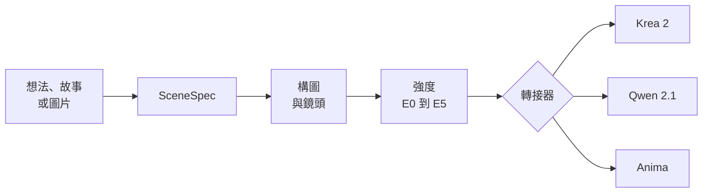

<p align="center">
  
</p>

<p align="center">
  <a href="../README.md">English</a> | <b>繁體中文</b>
</p>

<p align="center">
  <a href="../LICENSE"></a>
  <a href="https://skills.sh/Zhen-Bo/image-prompt-gen"></a>
</p>

一個 Agent Skill，把場景想法、故事或參考圖片，變成可以直接貼進本地 **Krea 2**、**Qwen Image 2.1** 或 **Anima** 工作流程的英文提示詞。

## 為什麼用這個 Skill

這個 Skill 的做法像編譯器，它會先決定**畫面是什麼**：發生的事件、構圖、鏡頭與光線。之後才決定要用你選的模型**怎麼說出來**。

所以當你換模型、調整強度等級，或是說「同一個場景，但改成晚上」，場景本身不會變，只有用詞會變。



每個請求都會先變成一份內部的場景描述（SceneSpec），再由各模型的轉接器，把同一個場景寫成該模型最容易理解的形式。

## 特色

- **以事件描述場景。** 提示詞描述正在發生什麼、誰有反應，而不是羅列物件。
- **構圖優先。** 每個提示詞都用看得見的方式交代鏡頭，例如 `framed from mid-thigh up`，不會出現焦距、光圈這類相機術語。
- **修改保持一致。** `same scene, Qwen` 或 `same scene, E2` 只改你指定的部分，其他全部保留。
- **圖片反推。** 給一張圖和想要的格式，它會重建構圖與姿勢，讓換了 LoRA 也能維持相同構圖。
- **自動設計角色。** 沒指定外觀或只給部分外觀時，會依照她在場景裡的身分發想，補齊整套造型，並把材質與配件放在正確的位置。
- **多元發想，最小修改。** 要求同一主題的多個版本時，每個版本用不同的鏡頭、構圖、時間點或光線詮釋主題。修改既有提示詞時，只改受影響的字句。
- **畫風由 LoRA 決定。** 所以除非你要求，提示詞不會加 `masterpiece` 這類詞。

## 安裝

```bash
npx skills add Zhen-Bo/image-prompt-gen
```

開一個新的 Agent 對話。在 Claude Code 裡可以輸入 `/image-prompt-gen` 確認是否載入成功。

## 快速開始

直接描述場景，不用特別說「提示詞」。如果還沒選模型，Skill 會問你一次，之後就會記住。

```text
女孩坐在窗邊看雨，有點在等人的感覺，用 Krea 2
```

預期輸出是一段可以直接貼上的英文：

```text
A girl with a short platinum-blonde bob sits sideways on a wide wooden windowsill,
one knee drawn up and her chin resting on it, the hem of her oversized gray fleece
hoodie bunched around her hips. Her blue eyes follow the rain-covered street below...
```

> [!NOTE]
> 提示詞一律是英文。版本標籤、提問與說明則會跟著你使用的語言。

## 使用方式

### 常用說法

| 你說 | 結果 |
|---|---|
| `same scene, Anima` | 同一個場景，改寫成另一個模型的格式 |
| `same scene, E2` | 同一個場景，換成新的強度等級 |
| `改成晚上` | 只改你指定的部分 |
| `給我三個版本，不同時間點` | 同一主題的三種不同詮釋 |
| `逐步大膽` 或 `escalate` | 每個版本在構圖與創意上更進一步 |
| 一張圖片加上格式，例如 `反推 Anima` | 保留原圖構圖的反推提示詞 |

### 支援的模型

| 模型 | 提示詞形式 | 適合 |
|---|---|---|
| **Krea 2**（precise） | 一段精簡的段落 | 乾淨、可控的構圖 |
| **Qwen Image 2.1**（raw，不經提示詞擴寫） | 較長的段落，空間描述更明確 | 沒有擴寫器時的精準擺位 |
| **Anima** | 先一段 booru tag，再一段英文敘述 | 用 tag 與描述訓練的動漫模型 |

### 強度等級

| 等級 | 名稱 | 也可以說 |
|:---:|---|---|
| E0 | SFW | SFW |
| E1 | Suggestive | 曖昧 |
| E2 | Sensual | 性感 |
| E3 | Erotic nudity | 裸體情色 |
| E4 | Explicit | 強烈色情 |
| E5 | Fully explicit | 赤裸色情 |

E2 到 E5 可以選擇全裸或半遮半掩。所有角色都是成年人，E0 以上的等級僅供成年使用者使用。反推時等級由圖片判斷，你只需要選格式。

## 檔案結構

```text
image-prompt-gen/
├── SKILL.md                    核心規則與編譯流程
├── LICENSE                     MIT 授權
├── agents/openai.yaml          顯示用的中繼資料
├── assets/                     README 圖片
├── docs/                       繁體中文文件
└── references/
    ├── krea.md                 Krea 2 轉接器
    ├── qwen.md                 Qwen Image 2.1 轉接器
    ├── anima.md                Anima 轉接器
    ├── camera.md               景別、角度、裁切、可見性檢查
    ├── composition.md          多人與故事場景
    ├── erotic-intensity.md     E0 到 E5 規則
    ├── character-looks.md      自動發想角色的方法
    └── reverse-prompt.md       圖片反推
```

Agent 只會讀取這次請求需要的參考檔，所以簡單的請求很輕量。

[SKILL.md 的繁體中文對照版](SKILL.zh-TW.md)放在這個資料夾，僅供閱讀。Agent 實際使用的是根目錄的英文版。

## 限制

- 只支援上面列出的模型。要求其他模型時，只會收到一句說明，不會產生提示詞。
- 反推的準確度取決於 Agent 的圖像辨識能力。左右方向、小配件和頭部傾斜最容易看錯，生成前建議先檢查。
- 請用原圖的比例生成。比例不同，不論提示詞怎麼寫，構圖都會跑掉。
- 畫風、品質 tag 與負面提示詞交給你自己的工作流程。

## 路線圖

- [x] Krea 2、Qwen Image 2.1 與 Anima 轉接器
- [x] 圖片反推
- [ ] NovelAI tag 格式
- [ ] Stable Diffusion tag 格式

## 致謝

**[tag-skill](https://github.com/1756141021/tag-skill)** by [@1756141021](https://github.com/1756141021)，提煉自戒红所（`red_relief_reformatory`）的 TAG 法典

- 把提示詞中的位置視為隱性權重，讓女孩的造型沿著觀者的視線分散
- 服裝寫出材質，場景至少用三個具體物件撐起空間
- 對使用者沒指定的元素做概念融合
- 需主動開啟的「逐步大膽」多版本模式
- 檢查每個描述的元素在畫面中是否真的看得到
- 反推時只寫看得到的內容，不猜測角色身份

## 授權

以 [MIT License](../LICENSE) 釋出。
